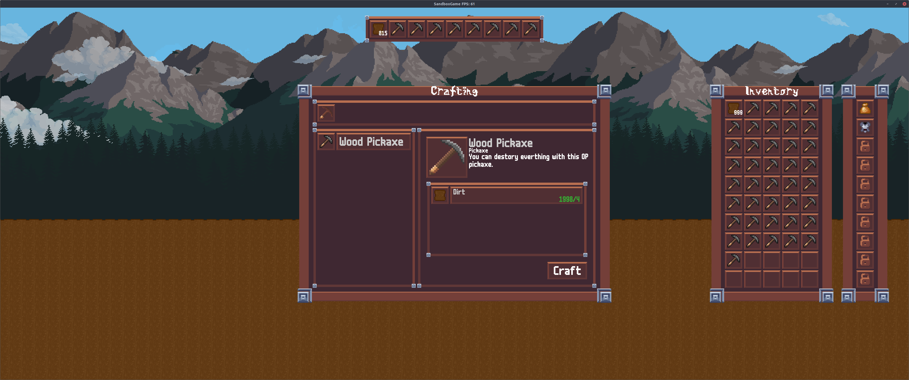
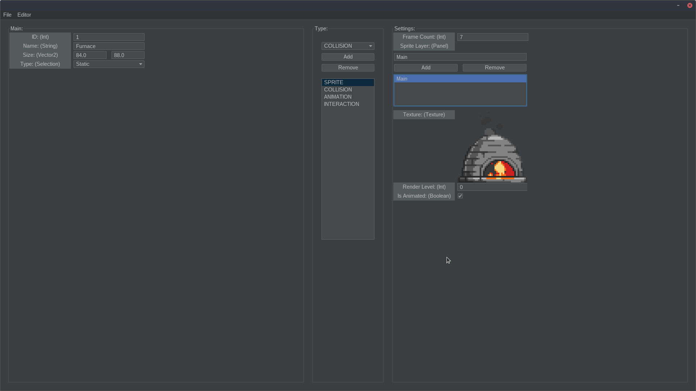
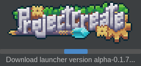
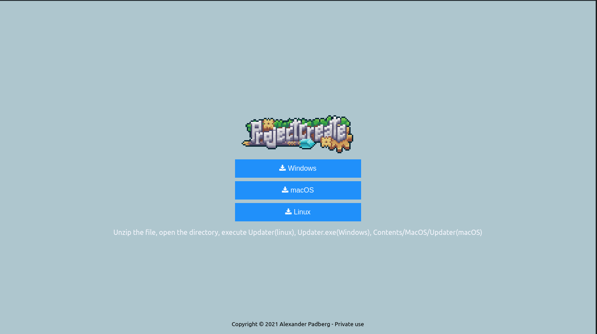
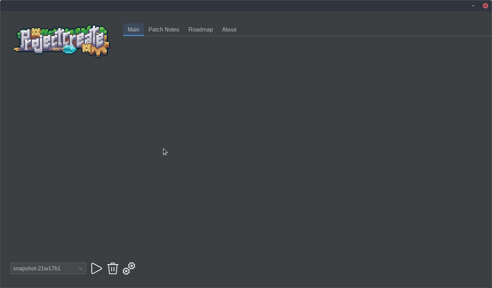
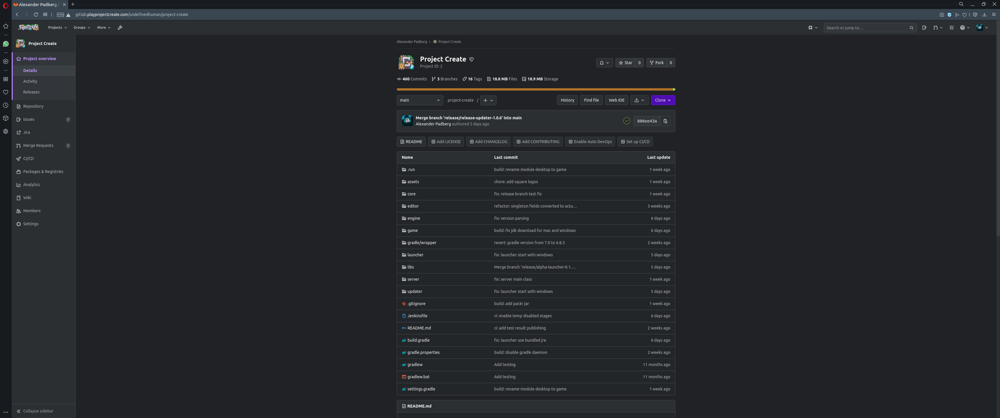
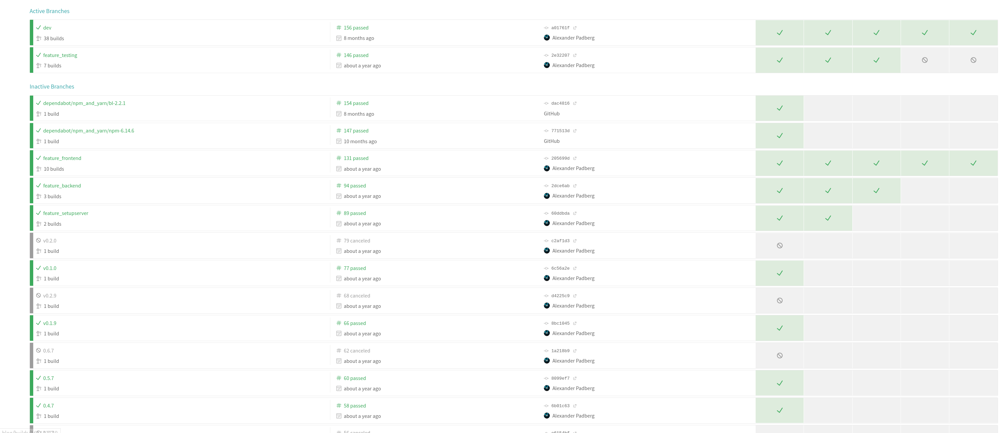
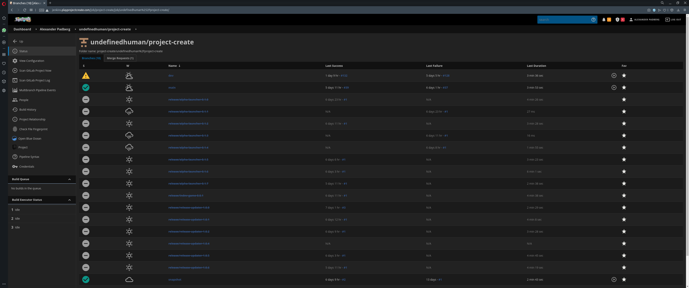
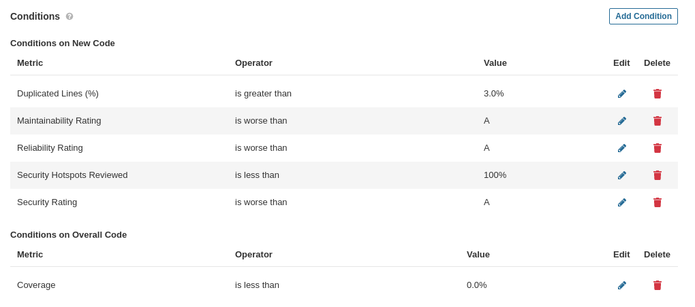
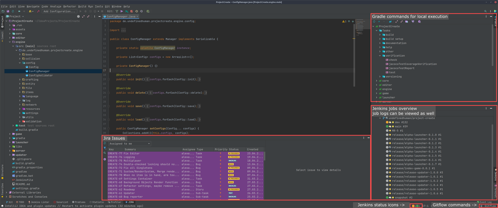

## **ProjectCreate**

is a 2D side-scrolling game that was born out of the desire to play a game that has everything me and my friends could dream of. I started the project over 4 years ago, at least the first "playable" version I can find in my records is from September 2017, and it has been rewritten from scratch at least 4 times since then. I also use this project as a sort of development playground where I try anything I want with no pressure, deadlines, fixed requirements and the only restriction being my creativity. I redesign a lot of the features and implement a lot of " unnecessary" stuff, out of curiosity about how to implement certain things. I use a very limited number of frameworks, normally when programming a game to be released at this scale it would probably be best to choose one of the big game engines out there, but I have already programmed a custom 3D rendering engine in the last months/years and in the near future I will add 2D rendering capabilities to it and then even the last big external framework will be replaced by a custom designed solution of mine.

## **Project Modules**

The project is divided into different modules (sub-projects), which are stored in a monorepo due to the high dependency of the individual modules on each other, which allows for less cumbersome development:

### Engine

Contains all the foundation code used in almost every other module. This engine includes basic systems such as a custom logger, a file module (reads and writes internal and external files, serialization with Base64, etc.), configuration and multi-language support, a set of utility classes, handling of resources such as textures, sounds, fonts, etc., the basic framework of a custom entity component system and an item system, and a global configuration/settings system that allows dynamic versioning of various parts of the game.

### Core & Game

Contains all code relevant for the game client, such as the camera system, scene background handling, item and entity implementation, rendering, custom user interface, client-side network code, collision detection, world creation/rendering/handling, window and screen management, player inventory/data storage, etc.

Note: Most of the code currently implemented within the client will be moved to the server side in the near future.

### Server

In the current version so far only a very small program to test the CI/CD features. Has already been implemented to a significant extent in an older version of the game and is the next section to be re-implemented in the current version.

### Editor

A graphical interface that provides the ability to dynamically create new entities and items for the game and export them as a text file so the game client and server can load them without me having to hard code them. 

### Updater & Website

The updater is a small program that the user downloads which then automatically updates and launches the launcher. It comes with a bundled JRE and an operating system specific executable, therefore the user is not required to install anything except the updater. The user can download a zip file containing all the relevant files from a small website I programmed.

### Launcher

Through the launcher, the user can download and handle different versions of the game, change settings (for example, currently the initial and maximum memory usage of the game). In order to start the launcher, the updater uses the bundled JRE and the launcher also uses it to start the game.

### Gitflow

I've known Gitflow for some time now, and wanted to look at trunk-based development and other branching models as well, but in comparing them and considering my requirements, I've come to the conclusion that Gitflow works best for me.

Here are some of my reasons against trunk-based development with the use of practices such as feature flagging:

1. Solo developer
2. I want manual development test releases, without much effort (snapshot branch, pull request (dev → snapshot) triggers an automatic release of a snapshot)
3. I want stable releases with lots of features (each stage or major version increase, e.g. 1.1 → 1.2, should include enough features that users come back and play the game again), no need for fast feature releases and every feature planned for the release should be implemented and properly tested
4. Release candidates before releases, to test main versions extensively (release branch, with easy trigger to make it the release version → merge into main)
5. Slightly faster release of new features for updater, launcher and editor
6. Limited number of security checks to guarantee that the current state of the project can be released

This may also change in the future, and a quick release of new features could also be a new and refreshing approach to game development, but right now it doesn't make much sense to me. And I need to test the new approach properly first, but I'm currently in the phase of testing my now implemented system. 

In my current implementation, I use the Gitflow model in its full intent, with the addition of the snapshot branch.

### Testing

At the moment, the test suite is not even close to being sufficient for a proper implementation in a well-designed CI/CD pipeline. This is unfortunately, an active decision on my part, due to the very "early" stage of development. While I have had a pretty solid amount of tests in an earlier version, I decided to remove all of them, since this is a very long term and learning project and I'm trying out a lot, so I'm not just changing code which would result in maintainable, testable code, but I'm replacing whole modules, changing their entire structure, which would make large parts of the tests unusable and at that stage of the project just slow me down.

In a "normal" project I also structure and write code so that it is easy to maintain and does not break the entire test suite in case of simple refactoring, but in the current phase of the project I find this very exhausting, moreover I write new modules and code already so that it is theoretically testable. As soon as I have reached a solid base the project will be directly equipped with an extensive number of tests, planned for this is the transition from Indev -> Alpha.

If anything, the current implementation of the tests is more like a proof of concept:

**Unit tests:** The implementation of those is actually complete and only lacks scaling, i.e. the currently existing stages can be used in the future as well, only additional tests need to be added.

**Integration tests:** A decent implementation is completely missing, since I haven't re-implemented the server in the current version yet, there isn't much that could be tested with integration tests. Also in order to properly implement these in the CI pipeline I need to be able to run the game on the server, which is usually a bit complicated since the server doesn't have a graphics card, one solution I could think of is to use the libGDX headless functionality which essentially launches a game instance without rendering anything. I've also thought about setting up a test server instance on my local computer and making it a background process. Nevertheless, deploying and launching the parts to be tested by the integration tests shouldn't be that different from what I'll describe below (deploying test server instances), yet there will probably be many difficulties I don't know about yet.

**Load & Soak tests:** Once the basics of integration testing are back up and running, I'm very interested in implementing soak testing for the server: running a server instance and having test users connect to test performance under real-time conditions, and for the game: I'd like to do soak testing especially at the beginning of preparing for a release = launch a game instance and run it for several hours, doing a routine of tasks, observing computer stats like CPU, RAM, etc.

**Play tests:** Already provided through manual snapshot releases, which can then be downloaded by my small group of testers (friends).

### Continuous Delivery

Since my testing stage is not properly implemented and I can't think of a way to fully test a game to make sure it's ready for production, I decided against continuous deployment. I rather have full control over what and when new features are released to production. Since I also want to provide as many new features as possible in a new release to encourage the player to play the game again, as already mentioned.

With snapshot versions, the same principle applies: I want to test certain features with my test group, so I want to have full control over what goes into the snapshot version.

For example: The circumstance that made me start this whole journey of learning CI/CD was that I wanted to test a new UI component on various screens with my friends, etc., I wanted my friends/testers to be able to press three different temporary buttons to test three different situations of the GUI element. These three buttons had to be temporarily implemented in the snapshot version.

Sidenote:
At that time, I was not able to send them a playable file of the game, which led me to learn and implement CI/CD.

### Tools

**GitLab:** I've been wanting to try GitLab for a long time to see if there were any advantages over GitHub in my use cases. And to be 100% honest, I didn't like the first GitHub dark theme, which led me start looking for alternatives.

**Jenkins:** I already used "Travis CI" in the past for a small blog I written for a STS module, which was the first project I tried to implement a really small CI/CD Pipeline:

**Technologies:** NodeJS, NPM, Express, HTML, JavaScript, SCSS/CSS, Travis CI, Docker
**GitHub Repo:** [https://github.com/undefinedhuman/sts-blog](https://github.com/undefinedhuman/sts-blog)
**Link(Production, completely broken):** [http://144.91.69.99:3000/index.html](http://144.91.69.99:3000/index.html)

Travis CI is also fun and was straightforward to set up, though I also wanted to try different tools. Wanting something that doesn't cost anything (like GitLab CI, where you have to pay a monthly fee once you reach 400 CI/CD minutes), preferably an on-premise solution, fairly customizable, suitable for building a CI/CD pipeline for a game project, and that supports all the tools I intended to use - that's how I ended up with Jenkins.

I use a variety of plugins to implement all my requirements. Most importantly, however, is the "GitLab Branch Source" plugin, which allows me to use a multi-branch repository from GitLab in my Jenkins instance. The plugin automatically detects newly created branches in the repository, creates a new pipeline for said branch, sets up webhooks in GitLab that notify the pipeline in case of new activity on the branch, and allows the pipeline status to be reported back to GitLab.

One thing I want to take a closer look at in the future is how to properly test the pipeline on my local machine, so far I've always had to commit every change and run the entire pipeline.

**Jira:** Current choice for task and issue tracking, will be replaced by two separate tools in the near future. Issue tracking will then be handled by YouTrack (instance already running at [http://youtrack.playprojectcreate.com](http://youtrack.playprojectcreate.com/), going public so anyone can report issues), for task tracking I'm still looking for a feasible solution that allows to properly plan the different major releases and still provide easy tracking for current tasks. Planned versions should be fetched by the launcher and website to show a roadmap.

**SonarQube:** Is my choice to do static code analysis, it was my choice because it is a on-premise solution that is free for any amount of analysis time etc, it was integrated easily with my already in use software like Gradle, Java and Jenkins, and it is considered to be the best option for Java code analysis. I use custom quality gate settings which also include code test coverage (currently disabled, will be enabled once test coverage reaches a decent level).

### **Integration**

When choosing all of the tools, it was important not only that they integrate well with each other, but also that they integrate flawlessly with my current IDE. I wanted as much feedback and automation without leaving my IDE as possible.

In addition, I use the SonarLint plugin, which is connected to my SonarQube instance, that generates instant feedback and lets me view all SonarQube issues.

### Features Planned

**Monitoring** snapshot/dev/release candidate versions, bug reporting, etc is something that is completely missing right now.
Some things I want to implement, but haven't had time to do yet:

- Simple bug reporting - buttons in the launcher, website, and game that open a link that takes the user to a Jira/YouTrack form where the user can report a bug
- Later, this will be replaced by an actual GUI in the game where the user can enter a title, screenshots, system information (JVM and system settings, OS, Java version and info, etc.), a description of how to reproduce the bug, world file (for me to download and test directly in the user's world) → which then automatically creates a YouTrack issue
- For better monitoring I want to introduce a performance tracker, libGDX already allows me to track GL_DRAW_CALLS, active texture units, FPS etc., additionally I can track RAM and CPU usage, all of course with the user's consent, I additionally plan to create a small program where everything that updates every frame can report its stats and the tool will track them all
- Web interface for better visualization of reports - this looks pretty interesting: [https://gameanalytics.com](https://gameanalytics.com/)

**Changelog Generation**

**Rollback:** Currently, when I want to revert a version, I connect to my server via FTP and delete the corresponding file manually, since the updater and launcher already check if newer versions are available, I also have to check if the current version is valid, otherwise delete it locally. Since I have planned to create a small web interface for viewing the error and performance reports, I would also like to introduce a small function to easily delete specific versions.

**Task Management:** Since each release has a defined feature set, if I integrate better task tracking software, I could define the versions there. If all tasks are done, automatically create a release branch where I then finish the release by proper testing and fixing the last bugs and then trigger the final release.

**Security:** While implementing the upload of the release/snapshot files to the remote download server, I had to implement authentication via SSH. When disabling the password login, I accidentally made it so that if the SSH login failed, the password login would be skipped because it is disabled, but the server did not deny the connection due to the lack of authentication, it let the user through and I was able to log in without anything. I luckily noticed this by manually testing the connection, but there might be a lot more of these security issues and I definitely want to look more into security best practices related to CI/CD.

**Rolling Releases:** As you can see in my diagram, I not only distribute the files to a remote directory where users can download the files from, but also to my private test server where I host multiple server instances, two for testing purposes and one that is actually for my friends to play the game. It may not be a big deal, but when I update the server files, there is currently a small downtime while the server files are replaced and the server restarts. I would like to address this issue in the future as there will be multiple sub-servers, a lobby server that the player initially connects to and sends the player to their respective server, and the various game servers. In this step I can do a rolling release, I start the new server and each new player that connects is sent to that server, and the old server continues to run until the last player disconnects, then I stop and delete the server. This would mean no downtime for old and new players, plus I could experiment with other deployment techniques for example canary deployments.
****

**Editor and Server file download:** Currently there is no way for the player to download the server and editor files, but since it is no difference from downloading the game, it is a matter of properly copying and pasting.